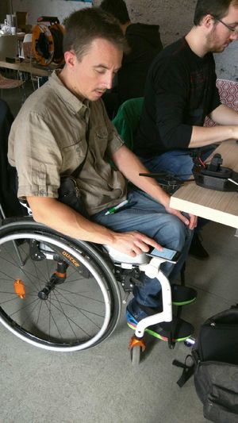

# Smartchair
Projet de portail destiné au concept SmartChair dans le cadre de l'atelier Objets Connectés du 3 octobre 2015

## Génèse
La problématique initiale était liée à un besoin quotidien d'un des participants, Alex, en fauteuil roulant : pouvoir utiliser son smartphone en "mains libres".

Nous cherchons à réaliser un support pour smartphone qui permette de conserver l'esthétique, ne pas faire quelque chose de Robocop et qui puisse permettre de venir sous une table.

Il existe des supports pour smartphone pour fauteuil roulant avec un retour type tablette au dessus des genoux. Les prix sont relativement élevés. L'objet ne permet de passer sous une table, il est trop haut.

D'un autre coté, la solution des support de smartphone pour vélo semble réponde à nos besoins. 
Nous ajoutons une dimension écoresponsable au projet. Nous nous inspirons d'une principe d'une pince à linge en bois. Nous usinons directement dans la masse pour former l'objet avec une inclinaison facilitant la lecture et l'usage.

Le telephone sera maintenu par 2 rubans élastique plat qui viendront assuré la stabilité et le maintien global du telephone.

A ensuite germé l'idée de ne pas se limiter au simple support, pour venir proposer une réponse globale à différentes problématiques :

- Recharger son téléphone
- Etendre les fonctionnalités du téléphone (GPS, Chromecast, etc)
- Visualiser ce qui se passe derrière lui (par exemple en sortie d'ascenceur)

Nous avons décidé de réaliser une petite centrale intelligente qui viendrait se glisser derrière le fauteuil, et qui rassemblerait quelques unes de ces fonctionnalités.

## Rendu final

Voici le résultat 

Détails techniques :

- Boîte réalisée en découpe laser
- Batterie 4000 mAh (comme celles des téléphones portables)
- Raspberry Pi 2 + caméra

## Détails techniques
En résumé le boîtier est équipé :

- de Raspbian (version jessie) + de la caméra native pour Rapsberry Pi
- d'un serveur NodeJS
- d'un duo raspistill + MJPEG Streamer qui permettent de renvoyer un pseudo-flux vidéo à l'extérieur
- d'un dongle Wifi pour la connexion

Les détails de configuration sont disponibles sur [la notice technique](TECHNICAL_DETAILS.md).

## Etude des fonctionnalités/usages

Vous trouverez également des pistes d'éventuelles utilisations et fonctionnalités sur la [liste des fonctionnalités](FEATURES.md).

